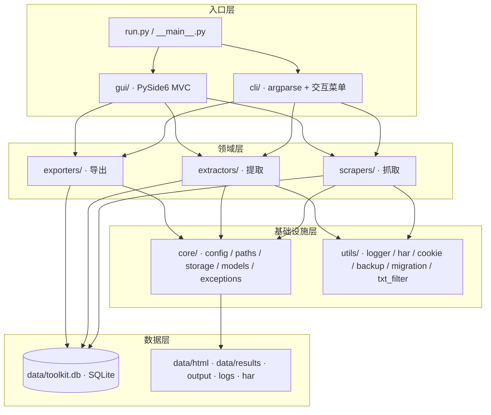
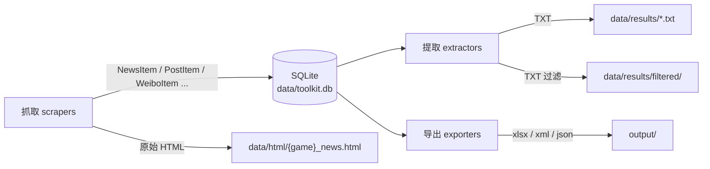
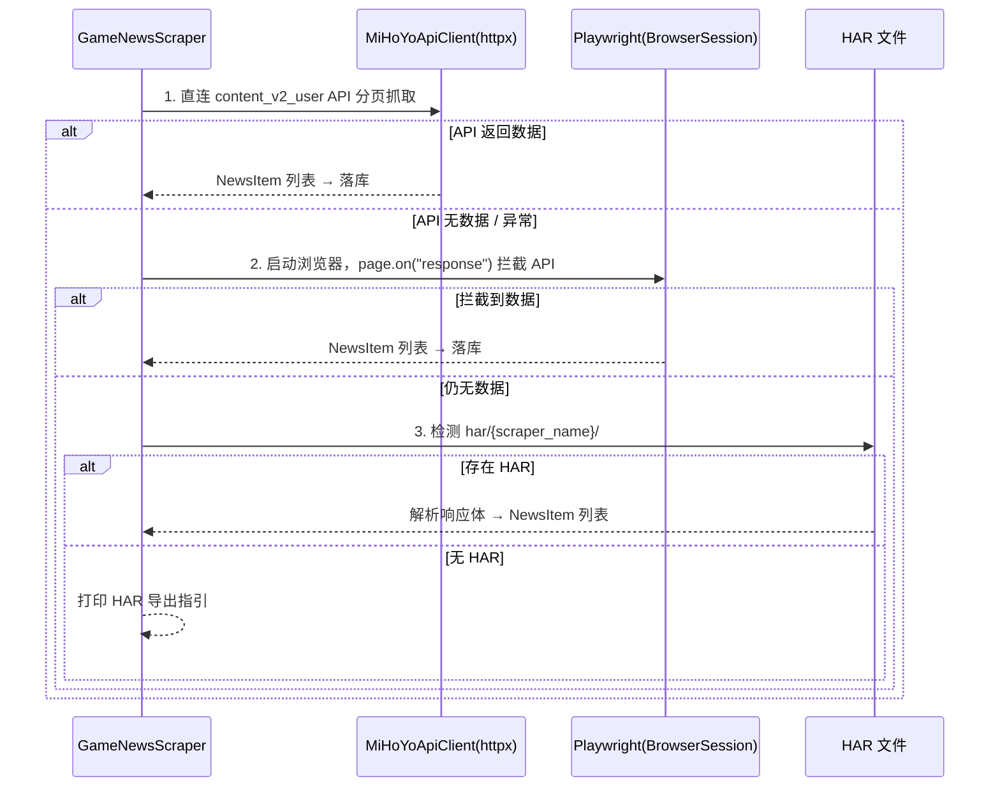
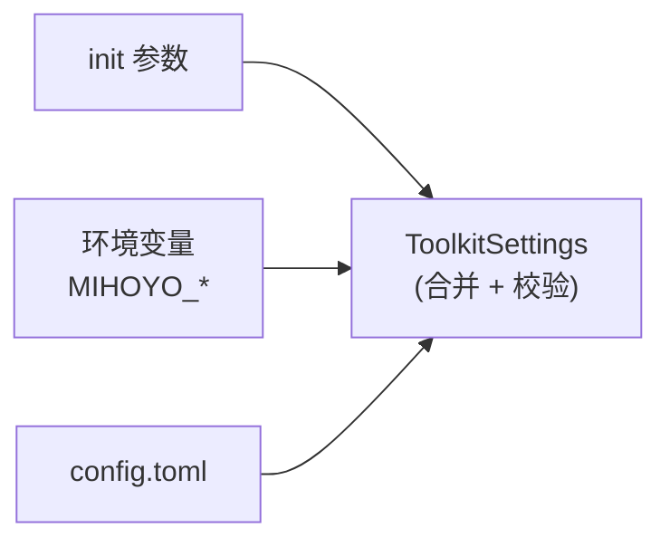
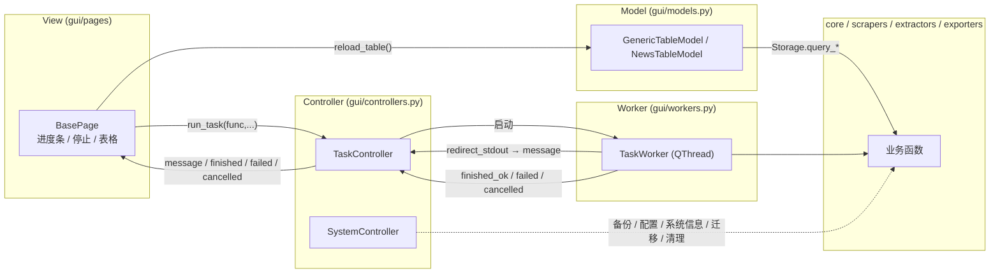

# 架构文档 · 米游社工具箱 v2.1.0

本文档描述 v2.0.x 架构级重构后的**分层结构、数据流、关键机制与扩展方式**。
面向维护者与 AI Agent。

---

## 1. 分层架构



### 职责划分

| 层 | 包 | 职责 |
| ------ | ------ | ------ |
| 入口 | `cli/` `gui/` | 用户交互；**不实现业务逻辑**，仅编排领域层服务 |
| 领域 | `scrapers/` `extractors/` `exporters/` | 抓取 / 提取 / 导出；只依赖 core 与 utils |
| 基础设施 | `core/` `utils/` | 配置、路径、存储、模型、异常；日志、HAR、Cookie、备份、迁移、过滤 |
| 数据 | SQLite + 文件系统 | 唯一持久化载体 |

依赖方向**自上而下单向**：入口 → 领域 → 基础设施 → 数据。任何反向依赖均为设计违规。

---

## 2. 数据流



要点：

1. **抓取层直写 SQLite**：抓取器解析得到的模型对象经 `Storage.upsert_*` 落库，
   以唯一索引实现幂等去重（重复抓取不产生重复行）。
2. **提取层读库导出**：`extractors/*` 不再解析 HTML，而是「读库 → 排序 → 写
   `data/results/*.txt`」（教程除外，仍保留 HTML 解析并同时落库 + 导出）。
3. **导出层读库生成**：Excel / RSS / JSON 均从 SQLite 读取，写出到 `output/`。
4. **HTML 仅作留档**：`data/html/{game}_news.html` 保存抓取时的页面快照，便于排查。

### 三类数据消费入口

| 消费者 | 读取方式 | 产物 |
| ------ | ------ | ------ |
| CLI 交互菜单 | `Menu` → `registry` handler | 依命令而定 |
| CLI 非交互 | `__main__._dispatch` | SQLite / TXT / xlsx / feed |
| GUI | `TaskController` 后台线程调用同一 core/领域函数 | 同左 + 界面日志 |

---

## 3. 抓取策略：API 优先 → Playwright → HAR

四站点新闻采用**三轨回退**策略（`scrapers/news/base.py: GameNewsScraper.fetch`）：



- **增量终止**：`incremental=True` 时预取已有 URL 集合，抓到已存在 URL 即提前停止
  （由 `config.incremental.stop_on_existing` 控制）。
- **重试**：API 请求用 `tenacity` 指数退避（最多 3 次）。
- 其他来源（用户发帖 / 微博 / 教程 / 图鉴）采用 **Playwright + API 拦截 + HAR 回退**
  的相同模式（基类 `BaseScraper` 提供公共能力）。

---

## 4. 配置系统

基于 **pydantic-settings**（`core/config.py: ToolkitSettings`）。



- **加载优先级**：`init 参数 > 环境变量 > config.toml`
  （由 `settings_customise_sources` 返回顺序决定）。
- **环境变量命名**：前缀 `MIHOYO_`，嵌套用 `__`，例如
  `MIHOYO_FETCH__HEADLESS=false` 覆盖 `[fetch].headless`。
- **缓存与重载**：`get_settings()` 为 `lru_cache(maxsize=1)` 单例；
  `reload_settings()` 清缓存并重建。
- **路径覆盖**：`MIHOYO_HOME`（项目根）、`MIHOYO_DATA_DIR`（数据目录）。
- **强类型校验**：`NewsSiteSource` 校验站点配置；`sources` 至少一个新闻站点。

### 配置模型层级

```
ToolkitSettings
├── app:           AppSettings(mode, version)
├── fetch:         FetchSettings(headless, wait_seconds, timeout, scroll_delay, ...)
├── retry:         RetrySettings(max_attempts, delay)
├── incremental:   IncrementalSettings(enabled, stop_on_existing, merge_data)
├── backup:        BackupSettings(enabled, max_backups)
├── cookies:       CookieSettings(use_firefox)
└── sources:       SourcesSettings
    ├── user:      UserSource(url)
    ├── baike:     BaikeSource(url)
    ├── weibo:     WeiboSource(url)
    └── news:      NewsSources(genshin, genshin_en, zzz, starrail: NewsSiteSource)
```

---

## 5. 存储 Schema

单文件 SQLite（默认 `data/toolkit.db`，WAL 模式）。5 张表：

| 表 | 唯一约束 | 关键字段 |
| ------ | ------ | ------ |
| `news` | `UNIQUE(game, url)` | `game, info_id, title, start_time, category, intro, poster_url, url, raw(JSON)` |
| `posts` | `post_id UNIQUE` | `post_id, title, created_at, url, content` |
| `weibo` | `post_id UNIQUE` | `post_id, text, created_at, url, reposts, comments, attitudes` |
| `tutorial` | `UNIQUE(character_id, lang)` | `character_id, name, lang` |
| `images` | `image_url UNIQUE` | `character_id, name, image_url` |

**索引**：

```sql
CREATE INDEX idx_news_game_time ON news (game, start_time DESC);
CREATE INDEX idx_news_info_id   ON news (game, info_id);
```

**幂等写入**：所有 upsert 使用 `INSERT OR IGNORE`，返回值为「写入前后行数差」即新增条数。
`Storage` 为上下文管理器：

```python
with Storage() as store:
    new = store.upsert_news("genshin", items)
    counts = store.count_all()
```

---

## 6. 命令注册器

CLI 与 GUI 共享命令清单（`cli/registry.py` + `cli/commands.py`）。

```python
from mihoyo_toolkit.cli.registry import registry


@registry.register(
    key="user.fetch",
    label="抓取用户发帖主页",
    description="抓取米游社用户发帖主页并落库",
    group="米游社用户",
    order=0,
)
def user_fetch() -> None:
    run_user(incremental=False)
```

- `key` 为稳定标识（全局唯一，重复注册抛 `ValueError`）；
- `group` 决定菜单分组，`order` 决定组内顺序，组顺序为**首次注册顺序**；
- `registry.by_group()` 返回 `{group: [Command, ...]}`，`Menu` 据此渲染全局连续编号；
- 新增命令只需添加一个 `@registry.register` 函数，**无需修改菜单代码**。

---

## 7. GUI MVC 结构



### 信号流

1. **View → Controller**：页面 `run_task(func, label, ...)` 交任务给 `TaskController`。
2. **Controller → Worker**：`TaskController.run` 创建 `TaskWorker(func)` 并 `start()`。
3. **Worker → Controller**：Worker 重定向 `sys.stdout/stderr` 为 `_SignalStream`，
   按行 `message.emit`；结束发 `finished_ok` / `failed` / `cancelled`。
4. **Controller → View**：转发为 `message` / `progress` / `finished` / `failed` /
   `cancelled`，页面更新进度条、按钮与日志。
5. **协作式取消**：`request_cancellation()` 置标志；下一次写入输出流抛
   `TaskCancelledError` 终止任务 —— **无需修改 core 层代码**。

主要组件：

| 模块 | 组件 | 职责 |
| ------ | ------ | ------ |
| `gui/main_window.py` | `MainWindow` | 左导航 + `QStackedWidget` 内容区 + 底部 `LogViewer` |
| `gui/pages/base.py` | `BasePage` | 任务调度、进度条、停止按钮、结果表格刷新 |
| `gui/controllers.py` | `TaskController` / `SystemController` | 后台任务编排 / 系统服务门面 |
| `gui/workers.py` | `TaskWorker` | QThread 执行 + 输出重定向 + 取消点 |
| `gui/models.py` | `GenericTableModel` 等 | 只读表格模型，`reload()` 从库装载 |
| `gui/widgets.py` | `LogViewer` / `ProgressWidget` | 日志面板 / 进度组件 |
| `gui/fonts.py` `gui/theme.py` | 字体加载 / 双主题调色板与样式表（自动跟随系统深浅色） | 游戏字体与配色 |

---

## 8. 扩展指南

### 8.1 新增一个新闻站点

1. 在 `config.toml` 增加 `[sources.news.<key>]` 段（`url / label / scraper / api_base_url /
   api_chan_id / detail_url_pattern / ...`）。
2. 在 `core/config.py: NewsSources` 增补对应字段（保持声明即顺序）。
3. 在 `scrapers/news/` 新建子类并用 `@register_news("<key>")` 注册，声明 `game`。
4. 在 `extractors/news/` 新建 `GameNewsBaseExtractor` 子类，声明 `game`。
5. （可选）在 `cli/commands.py` 的 `NEWS_GROUPS` 增加分组，`_register_news_commands`
   会自动注册 4 条命令。

> 若站点复用 `content_v2_user` API，仅需配置，通常无需改抓取代码。

### 8.2 新增一条 CLI 命令

在 `cli/commands.py`（或新模块，并在 `__main__.main` 导入）添加：

```python
@registry.register(
    key="group.name",
    label="菜单标题",
    description="功能说明",
    group="分组名",
    order=0,
)
@log_function_call
def my_command() -> None: ...  # 调用 core / 领域层
```

### 8.3 新增一个 GUI 页面

1. 在 `gui/pages/` 新建 `BasePage` 子类，`_setup_ui()` 构建控件；
2. 用 `self.run_task(func, label, ...)` 触发耗时操作；
3. 在 `gui/pages/__init__.py` 导出，并在 `gui/nav.py` 的 `_GROUP_FACTORIES`
   （或 `_SPLIT_COMMANDS`）中登记 —— 导航项由命令注册表派生，未登记的命令会在
   装配阶段抛 `GuiError`。

---

## 9. 日志与错误处理约定

### 日志

| 文件 | 用途 | 入口 |
| ------ | ------ | ------ |
| `logs/console.log` | 终端全部输出（含 print） | `setup_console_log()` |
| `logs/gui.log` | GUI 面板消息 | `append_gui_log()` |
| `logs/app.log` | 结构化模块日志 | `setup_logger()` / `get_module_logger(__name__)` |

- 模块内统一 `logger = get_module_logger("<模块名>")`，禁止裸 `print` 于领域层
  （GUI 会捕获 print 但结构化日志更利于排查）。
- `@log_function_call` 装饰器记录命令的进入 / 完成 / 异常。

### 异常层级

```
MihoyoError
├── ConfigError          配置缺失 / 非法
├── NetworkError         HTTP / 浏览器网络失败
│   ├── RetryExhausted   重试耗尽
│   └── AuthError        登录态 / Cookie 失效
├── ParseError           页面 / API 解析失败
├── StorageError         SQLite / 文件读写失败
└── ScraperError         抓取器通用错误
```

约定：

- **基础设施层抛具体子类**（如 `StorageError`、`NetworkError`），并携带 `detail`；
- **入口层统一兜底**：`Menu._execute` 捕获 `MihoyoError` 打印友好提示，捕获其他
  `Exception` 记录 `logger.exception`，避免单条命令导致整体退出；
- **GUI**：`TaskWorker` 将 `MihoyoError` 转为 `failed` 信号，其他异常兜底不崩溃；
- **重试**：仅对可恢复的网络错误使用 `tenacity`（`retry_if_exception_type(httpx.HTTPError)`）。

---

## 10. 测试分层

分层标记由 `tests/conftest.py` 的 `pytest_collection_modifyitems` 钩子**按目录自动添加**，
用例里无需手写 `pytestmark`：

| 目录 | 标记 | 范围 | 依赖 |
| ------ | ------ | ------ | ------ |
| `tests/unit/` | `unit` | 单函数 / 类 | 无 |
| `tests/integration/` | `integration` | 本地 IO / SQLite / 子进程 | 文件系统 |
| `tests/e2e/` | `e2e` | 真实网络 API | 默认跳过（需 `MIHOYO_E2E=1`） |

```bash
pytest                          # 全部（e2e 自动跳过）
pytest -m unit                  # 仅单元测试
pytest -m integration           # 仅集成测试
MIHOYO_E2E=1 pytest -m e2e      # 真实网络端到端
```

覆盖率门槛 **≥80%**（`pyproject.toml` 的 `[tool.coverage.*]`，`gui/` 与 `__main__.py`
不计入）。e2e 也可在 Actions 页面手动触发 `E2E (manual)` workflow —— 该 workflow 只有
`workflow_dispatch`，不会随 push 自动运行。
